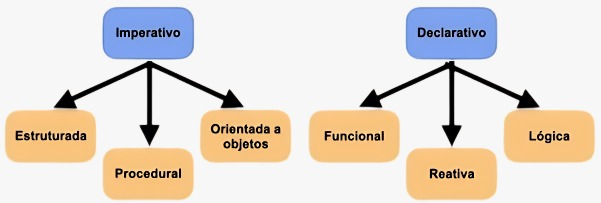

## Outros Fatos

## Curiosidades

    {/* Coluna de texto */}
    

        - Base na lógica matemática.
        - Similar a um problema em que um ser humano raciocinaria.
        - Linguagem declarativa.
        - Conjunto de premissas que devem ser satisfeitas para obter um retorno verdadeiro.
        - Marco da Inteligência artificial.
    

    {/* Coluna de imagem */}
    

        
    

## Características

- Utilização de backtracking.
- Independência da ordem das operações.

## Vantagens

- Permite a concepção da aplicação em alto nível de abstração
- Linguagem mais próxima do raciocínio humano.

## Desvantagens

- Dificuldade em lidar com problemas de algoritmos complexos.
- Complexidade exponencial.

## Diferenças do paradigma lógico para outros paradigma

- Imperativo x lógico
- Orientado ao objeto x lógico

---
Referências  
SUBVERTV, C. Linguagens de programação - paradigma lógico. Disponível em: https://www.youtube.com/watch?v=PjONeLBQCqk&t=13s.