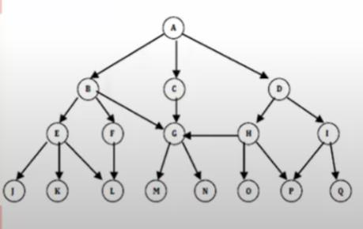

## Outros Fatos

## Curiosidades

- Base na lógica matemática.
- Similar a um problema em que um ser humano raciocinaria.
- Linguagem declarativa.
- Conjunto de premissas que devem ser satisfeitas para obter um retorno verdadeiro.
- Marco da Inteligência artificial.

## Características

- Utilização de backtracking.
- Independência da ordem das operações.

## Vantagens

- Permite a concepção da aplicação em alto nível de abstração
- Linguagem mais próxima do raciocínio humano.

## Desvantagens

- Dificuldade em lidar com problemas de algoritmos complexos.
- Complexidade exponencial.

## Diferenças do paradigma lógico para outros paradigma

- Imperativo x lógico
- Orientado ao objeto x lógico