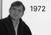

## História

O início da lógica está ligado ao pensamento científico. A lógica fornece uma linguagem precisa para a expressão explícita dos objetivos, conhecimento e suposições de alguém, além disso fornece a base para deduzir consequências de premissas, para estabelecer a consistência das alegações e verificar a validade dos argumentos de alguém.  

Ao longo dos séculos, a lógica passou de domínio filosófico para uma ciência aplicada que influencia diretamente no mundo atual, desempenhando um papel crucial em áreas como programação, inteligência artificial, matemática e ética (Avaliação de argumentos éticos, Resolução de dilemas morais, Consistência e Coerência etc.)  

No início da década de 1970 Robert Kowalski forneceu embasamento teórico para a programação lógica, e estabeleceu que a lógica de predicados poderia ser a base de uma linguagem de programação prática.

## História do Prolog

Na França no ano de 1972 Alain Colmerauer e sua equipe na Universidade de Aix-Marseille, em colaboração com outros pesquisadores desenvolveram Prolog. O interesse inicial era o processamento da linguagem natural, ou seja, construção de um sistema capaz de compreender e gerar a linguagem humana.  

Em 1972, Colmerauer e sua equipe desenvolveram o primeiro intérprete Prolog (um software capaz de executar programas escritos na linguagem). A chave para o sucesso do Prolog foi a combinação de lógica de predicados e o uso de unificação e backtracking como mecanismos de inferência. Esses mecanismos permitiram ao Prolog explorar múltiplas soluções possíveis para um problema, recuando e tentando novos caminhos quando necessário.  

A contribuição de Robert Kowalski foi crucial para a estrutura teórica da linguagem; um dos marcos dessa ideia foi o artigo intitulado “Prediate Logic as a Programming Language” (Lógica de Predicados como uma Linguagem de Programação).  

O trabalho de Alain Colmerauer e sua equipe na Universidade de Marselha foi o ponto de partida para o desenvolvimento de uma das linguagens de programação mais influentes no campo da IA. A França não apenas deu origem ao Prolog, mas também ajudou a promovê-lo internacionalmente, consolidando sua importância no desenvolvimento de sistemas lógicos e especialistas. O termo Prolog é derivado da expressão “Programming in Logic".

## Momentos históricos Prolog

    

        
        <h3 style={{ margin: '8px 0' }}>Alain Colmerauer e Philippe Roussel</h3>
        
Desenvolvimento da primeira versão em Marselha.

    

    

        
        <h3 style={{ margin: '8px 0' }}>Universidade Edinburgo</h3>
        
Lança o Edinburgh Prolog que se torna a implementação mais popularF.

    

    

        
        <h3 style={{ margin: '8px 0' }}>Projeto de computadores de quinta geração</h3>
        
Prolog é amplamente utilizada no projeto de computadores no Japão

    

    

        
        <h3 style={{ margin: '8px 0' }}>A jornada do Prolog nas Décadas de 1990 e futuras</h3>
        
Prolog continua a ser usado em nichos especializados e como ferramenta educacional em cursos de IA e lógica

    

